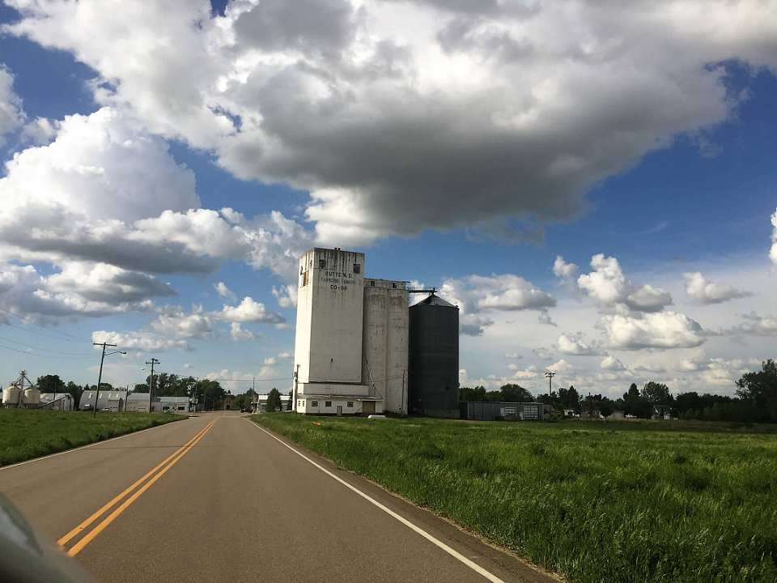

---
output:
  fidelius::html_password_protected:
    output_format:
      rmarkdown::html_document:
        toc: true
        toc_depth: 2
        toc_float: true
        number_sections: false
        code_folding: hide
        df_print: paged
        code_download: true
        theme: readable
    password: "Test"
---

```{r setup, include = FALSE}
knitr::opts_chunk$set(echo = TRUE,
                      error = TRUE)
```

# Description

This site will contain contact information relating to all things Butte.


# To Do

1. Add all contacts relating to Butte
1. Add videos of how to open up and close down the Butte house
1. Add a list of everything we need to buy 

please work



